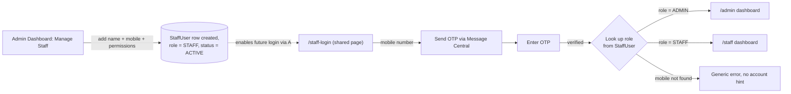
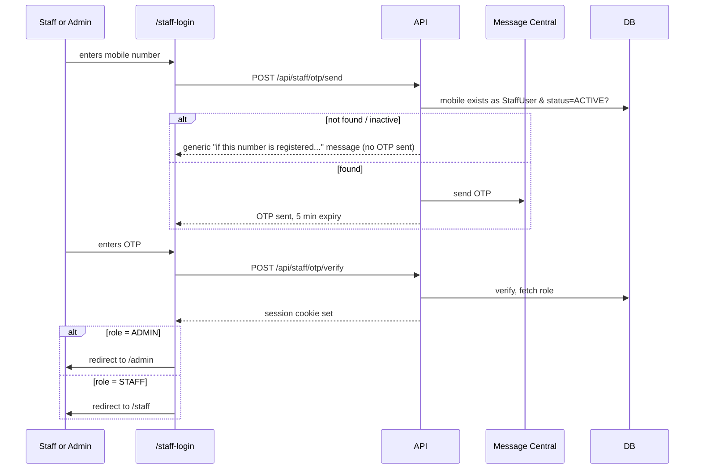

# TiffinOS — Remove Firebase, Unify Staff+Admin Auth on Message Central
## Complete Implementation Plan

> **Relationship to the other plan:** the customer-facing auth/ordering/admin plan (`TiffinOS-Auth-Ordering-Admin-Implementation-Plan.md`) assumed a staff/admin auth model already existed and referenced it only as `actedByStaffId: String`. **This document is that model** — implement it and point `actedByStaffId` at `StaffUser.id`. The two plans share the OTP + rate-limiting infrastructure (§9 below extends `lib/rate-limit.ts` and the `OtpAttempt` table from the other plan rather than duplicating them) — if you're building this standalone, the minimal schema needed is included inline so nothing is missing.

---

## Table of Contents

1. [Scope & Goals](#1-scope--goals)
2. [Current-State Audit — Find Every Firebase Touchpoint](#2-current-state-audit--find-every-firebase-touchpoint)
3. [Target Architecture](#3-target-architecture)
4. [Database Schema](#4-database-schema)
5. [Role Model & Permissions](#5-role-model--permissions)
6. [Admin Adds Staff — Flow](#6-admin-adds-staff--flow)
7. [Unified Login Page & Role-Based Redirect](#7-unified-login-page--role-based-redirect)
8. [Session & Route Guards](#8-session--route-guards)
9. [OTP via Message Central — Rate Limiting](#9-otp-via-message-central--rate-limiting)
10. [Bootstrap: Seeding the First Admin](#10-bootstrap-seeding-the-first-admin)
11. [Data Migration Playbook (Firebase → Postgres)](#11-data-migration-playbook-firebase--postgres)
12. [Firebase Removal Checklist](#12-firebase-removal-checklist)
13. [API Route Map](#13-api-route-map)
14. [Security Checklist](#14-security-checklist)
15. [Error Codes](#15-error-codes)
16. [Day-wise Implementation Plan](#16-day-wise-implementation-plan)
17. [Open Questions Log](#17-open-questions-log)

---

## 1. Scope & Goals

Two things happen together, in this order — **build the new system first, migrate data, cut over, then remove Firebase.** Never remove Firebase before the replacement is live and tested; that would lock every staff/admin out simultaneously with no fallback.

1. **Remove Firebase entirely** — Auth, Firestore (if used for staff records), config, SDKs, env vars, security rules — from the staff/admin side of TiffinOS.
2. **Replace it with**: mobile-number + OTP login via Message Central, for **both** staff and admin, through **one shared login page**. Role is stored in the DB and determines which dashboard the person lands on after login. Staff accounts are created only by an admin, from within the admin dashboard — there is no staff self-registration.

---

## 2. Current-State Audit — Find Every Firebase Touchpoint

⚠️ **ASSUMPTION**: this plan doesn't know exactly how deep Firebase is wired in (Auth only? Firestore for staff profiles too? Cloud Functions? Storage?). Run this audit first — it's the actual starting point of the work, not optional prep.

```bash
# Every source-code reference
grep -rn "firebase" --include="*.ts" --include="*.tsx" --include="*.js" --include="*.jsx" . | grep -v node_modules

# Config/env
grep -rn "FIREBASE" .env .env.local .env.production 2>/dev/null
cat package.json | grep -i firebase

# Common Firebase artifacts to check for
ls firebase.json firestore.rules firestore.indexes.json .firebaserc 2>/dev/null

# Common Firebase Auth patterns worth specifically grepping for
grep -rn "signInWithPhoneNumber\|RecaptchaVerifier\|onAuthStateChanged\|getAuth(\|initializeApp(\|signInWithEmailAndPassword\|verifyIdToken" --include="*.ts*" . | grep -v node_modules
```

Build a short inventory table before writing any new code — this determines how big §11 and §12 actually are:

| Firebase piece | In use? (fill in) | Replacement |
|---|---|---|
| Firebase Auth (phone or email/password) for staff/admin login | ? | Message Central OTP + custom JWT (§7, §8) |
| Firestore (staff/admin profile documents) | ? | `StaffUser` Postgres table (§4) |
| Firebase Admin SDK (`verifyIdToken` in middleware/API routes) | ? | Custom `verifyStaffSession()` (§8) |
| Firestore security rules | ? | Next.js middleware + server-side permission checks (§8) |
| `RecaptchaVerifier` (needed for Firebase phone auth) | ? | Not needed — Message Central handles OTP delivery, no client-side reCAPTCHA required |
| Firebase Storage (staff avatars, etc., if any) | ? | Out of scope here — flag separately if it exists |
| Firebase Cloud Functions | ? | Out of scope here — flag separately if it exists |

---

## 3. Target Architecture



Key points carried directly from your instructions:
- **One login page**, not two. The form is identical for admin and staff; only the post-login redirect differs, based on a DB field.
- **Staff accounts only exist because an admin created them** — there is no "Register" option on `/staff-login`, unlike the customer flow.
- **Role changes for elevating someone to ADMIN happen directly in the DB**, not through any UI or API button — this is a deliberate security boundary (§5, §10) so no code path can ever mint a new admin.

---

## 4. Database Schema

```prisma
enum StaffRole {
  ADMIN
  STAFF
}

enum StaffStatus {
  ACTIVE
  INACTIVE   // deactivated by an admin — cannot log in, existing session revoked
}

model StaffUser {
  id                String        @id @default(cuid())
  name              String
  mobile            String        @unique
  role              StaffRole     @default(STAFF)
  permissions       String[]      @default([]) // see §5 catalog — ignored entirely when role = ADMIN
  status            StaffStatus   @default(ACTIVE)

  createdByAdminId  String?
  createdBy         StaffUser?    @relation("StaffCreatedBy", fields: [createdByAdminId], references: [id])
  staffCreated      StaffUser[]   @relation("StaffCreatedBy")

  lastLoginAt       DateTime?
  createdAt         DateTime      @default(now())
  updatedAt         DateTime      @updatedAt

  @@index([role])
  @@index([status])
}
```

**Extending the shared OTP infrastructure** (from the customer auth plan's `OtpAttempt` model) rather than duplicating it — add one discriminator field and one purpose value:

```prisma
enum OtpActorType {
  CUSTOMER
  STAFF
}

enum OtpPurpose {
  REGISTRATION
  FORGOT_PIN
  RESUME_VERIFY
  STAFF_LOGIN        // ← new
}

// Add to the existing OtpAttempt model:
//   actorType   OtpActorType @default(CUSTOMER)
```

If you're implementing this **without** the other plan's `OtpAttempt` table already in place, here's the minimal standalone version:

```prisma
model StaffOtpAttempt {
  id            String      @id @default(cuid())
  mobile        String
  ip            String
  otpHash       String
  expiresAt     DateTime
  consumedAt    DateTime?
  wrongGuesses  Int         @default(0)
  createdAt     DateTime    @default(now())

  @@index([mobile, createdAt])
  @@index([ip, createdAt])
}
```

---

## 5. Role Model & Permissions

Two roles only — `ADMIN` and `STAFF`. `ADMIN` implicitly has every permission; the `permissions` array is only consulted for `STAFF` accounts, and it's an admin who sets it when adding/editing a staff member.

**Permission catalog** (extend as needed — keep it a flat string array, checked server-side on every relevant route):

| Permission string | Grants |
|---|---|
| `users:moderate` | Block/unblock customers (not ban — ban is ADMIN-only regardless of this flag, per the other plan's §11) |
| `menu:manage` | Edit daily menu, sabji options, add-ons, pricing |
| `orders:update-status` | Move an order through PLACED → ... → DELIVERED |
| `companies:moderate` | Verify / flag-fake a company (delete stays ADMIN-only) |

A route's guard looks like:

```typescript
// lib/require-staff-permission.ts
export function requirePermission(session: StaffSession, permission: string) {
  if (session.role === "ADMIN") return; // admins bypass the permission array entirely
  if (!session.permissions.includes(permission)) {
    throw new ApiError(403, "ADMIN_ONLY_ACTION" /* or a more specific PERMISSION_DENIED */);
  }
}
```

---

## 6. Admin Adds Staff — Flow

`POST /api/admin/staff` (ADMIN only)

```json
// Request
{ "name": "Nitrajsinh Solanki", "mobile": "9825098765", "permissions": ["menu:manage", "orders:update-status"] }

// Response 201
{ "staffId": "clx...", "role": "STAFF", "status": "ACTIVE" }
```

- Creates `StaffUser { role: STAFF, status: ACTIVE, createdByAdminId: <admin's id> }` immediately — **no OTP verification step needed at creation time**, because the admin is vouching for this person directly (unlike customer self-registration, there's no "prove you own this number" step for the *creator* — the proof happens naturally the first time the staff member themself logs in and receives the OTP on that mobile).
- The new staff member can now go straight to `/staff-login` and log in — no separate "activation" step required.
- `GET /api/admin/staff` — list all staff, filterable by status, ADMIN only.
- `PATCH /api/admin/staff/:id` — update `name`, `permissions`, or `status` (deactivate). **Does not accept `role`** — see §10 for why that's deliberate.
- Deactivating (`status: INACTIVE`) rather than deleting preserves referential integrity for `actedByStaffId` on historical `BanHistory`/`AdminAuditLog`/`OrderStatusEvent` rows.

---

## 7. Unified Login Page & Role-Based Redirect

`app/(staff-admin)/staff-login/page.tsx` — one page, two-step form (mobile → OTP), visually reusing the `OtpInputBoxes` component from the customer plan.



Same enumeration-safety pattern as the customer forgot-PIN flow: the send-OTP response never reveals whether a mobile is a registered staff mobile — it just says a code was sent "if" it's registered, and only actually dispatches one when it is.

```json
// POST /api/staff/otp/verify — response 200
{ "role": "ADMIN", "redirectTo": "/admin" }
```

The frontend just reads `redirectTo` from the response rather than hardcoding role logic client-side — keeps the role decision entirely server-side.

---

## 8. Session & Route Guards

Separate cookie namespace from the customer session, so the two systems never collide:

- Customer: `tos_session`
- Staff/Admin: `tos_staff_session` — httpOnly, Secure, SameSite=Lax, JWT payload `{ staffId, role, permissions, iat, exp }`.

```typescript
// middleware.ts (relevant excerpt)
export async function middleware(req: NextRequest) {
  const { pathname } = req.nextUrl;

  if (pathname.startsWith("/admin")) {
    const session = await verifyStaffSession(req); // decodes JWT AND re-checks StaffUser.status in DB
    if (!session || session.role !== "ADMIN") {
      return NextResponse.redirect(new URL("/staff-login", req.url));
    }
  }

  if (pathname.startsWith("/staff")) {
    const session = await verifyStaffSession(req);
    if (!session || !["ADMIN", "STAFF"].includes(session.role)) {
      return NextResponse.redirect(new URL("/staff-login", req.url));
    }
  }
}
```

Exactly like the "invalid JWT, not just absent JWT" point raised earlier for the customer flow: `verifyStaffSession` must re-check `StaffUser.status === ACTIVE` against the DB on every request (or at minimum on session refresh), not just trust the JWT signature — otherwise deactivating a staff member wouldn't actually revoke their existing session until it naturally expires.

**Admin gets a superset of staff access** (an admin can open `/staff` routes too) — flagged as an assumption in §17; say the word if admin and staff dashboards should instead be fully separate with zero overlap.

---

## 9. OTP via Message Central — Rate Limiting

Same mechanics as the customer OTP flow, reusing `lib/rate-limit.ts`, with its own prefixes so the staff/admin pool never shares a budget with customer traffic:

| Action | Scope | Limit | Window |
|---|---|---|---|
| Send OTP | mobile | 3 | 10 min |
| Send OTP | mobile | 5 | 24 h |
| Send OTP | IP | 15 | 10 min *(higher than the customer default — staff often share one office IP/WiFi)* |
| Verify OTP wrong guesses | single OTP | 5 | until expiry |
| OTP expiry | — | 5 min | — |

No device-fingerprint/blocking machinery is needed here the way it was for customers (§5 of the other plan) — the staff mobile pool is small, finite, and admin-controlled, so the realistic threat is someone hammering OTP-send against a *known* staff mobile, which the rate limits above already contain. If audit visibility is wanted, log `ip` and `userAgent` on every `StaffOtpAttempt`/login row regardless (cheap, useful for "who logged in from where" review) without building the full blocking cascade.

---

## 10. Bootstrap: Seeding the First Admin

This is easy to overlook and will block everything if skipped: **before cutover, at least one `StaffUser` with `role = ADMIN` must exist**, or nobody can log in to add anyone else. Since role elevation is intentionally not exposed via any UI/API (§5), this first row has to be created out-of-band.

```typescript
// scripts/seed-first-admin.ts
// Run locally / on the server, once, with direct DATABASE_URL access.
// Usage: npx tsx scripts/seed-first-admin.ts --name "Nikulsinh" --mobile "98250XXXXX"
import { prisma } from "../lib/prisma";

async function main() {
  const [name, mobile] = process.argv.slice(2); // simple positional args, adjust as preferred
  await prisma.staffUser.create({
    data: { name, mobile, role: "ADMIN", status: "ACTIVE" },
  });
  console.log(`Seeded first admin: ${name} (${mobile})`);
}
main();
```

Any *future* promotion to `ADMIN` (e.g., a trusted staff member should become an admin later) follows the same pattern — a small script run with direct DB access, never an HTTP endpoint:

```typescript
// scripts/promote-to-admin.ts
// npx tsx scripts/promote-to-admin.ts --mobile "98250XXXXX"
await prisma.staffUser.update({ where: { mobile }, data: { role: "ADMIN" } });
```

---

## 11. Data Migration Playbook (Firebase → Postgres)

Only relevant to the extent §2's audit finds actual staff/admin identity data living in Firebase. General shape:

1. **Export existing Firebase Auth users** (if Firebase Auth was the login mechanism): `firebase-admin`'s `listUsers()` gives you UID, phone number (if phone auth was used) or email (if email/password was used), display name.
2. **Handle the phone-number gap**: if Firebase Auth used email/password rather than phone, there may be no verified mobile number on file for existing staff. ⚠️ This needs a manual step — collect each current staff/admin's mobile number directly (ask them) before creating their `StaffUser` row, since mobile is now the login identifier and it must be one they actually control.
3. **Map to `StaffUser` rows**: for each existing staff/admin — `name`, `mobile` (collected), `role` (existing admins get `role: ADMIN` directly in this migration script — this is the one-time exception to "role changes happen manually," since it's data migration, not a live promotion path), `status: ACTIVE`.
4. **If staff profile data lived in Firestore** (not just Auth): export the relevant documents and fold any extra fields (e.g., existing permission flags, if any) into the new `permissions` array during the same migration script.
5. **Do not delete Firebase data until after cutover is confirmed stable** (§12) — keep it as a read-only backup for a safety window.

---

## 12. Firebase Removal Checklist

Only after §6–§8 are built, §11's migration has run, and staff/admin have successfully logged in through the new `/staff-login` at least once each:

- [ ] `npm uninstall firebase firebase-admin` (or whichever Firebase packages `§2`'s audit found)
- [ ] Delete Firebase config/init files (e.g., `lib/firebase.ts`, `lib/firebase-admin.ts`)
- [ ] Remove all `FIREBASE_*` / `NEXT_PUBLIC_FIREBASE_*` env vars — locally **and** in the hosting provider's (Vercel) environment settings
- [ ] Delete `firebase.json`, `firestore.rules`, `firestore.indexes.json`, `.firebaserc` if present
- [ ] Remove any `RecaptchaVerifier` components and `signInWithPhoneNumber`/`signInWithEmailAndPassword` calls
- [ ] Remove `onAuthStateChanged` listeners and any client-side Firebase Auth state/context providers
- [ ] Remove `verifyIdToken`/`getAuth()` usage from API routes and middleware — replaced by `verifyStaffSession()` (§8)
- [ ] Re-run the §2 grep sweep — expect **zero** matches
- [ ] Run a full build (`npm run build`) with no Firebase env vars present, to confirm nothing silently depends on them
- [ ] Smoke-test the full staff and admin login flow end-to-end one more time post-removal
- [ ] Optional, after a safety window: delete/downgrade the actual Firebase project in the console to stop any residual billing

---

## 13. API Route Map

| Method | Route | Auth | Purpose |
|---|---|---|---|
| POST | `/api/staff/otp/send` | none (rate-limited) | §7 |
| POST | `/api/staff/otp/verify` | none (rate-limited) | §7, issues `tos_staff_session` |
| POST | `/api/staff/logout` | staff session | clears cookie |
| GET | `/api/admin/staff` | ADMIN | list staff |
| POST | `/api/admin/staff` | ADMIN | §6, create staff |
| PATCH | `/api/admin/staff/:id` | ADMIN | update name/permissions/status — **never role** |
| GET | `/api/staff/me` | staff session | current session's name/role/permissions, for UI |

---

## 14. Security Checklist

- [ ] `role: ADMIN` is never settable through any HTTP route — only via the out-of-band scripts in §10.
- [ ] `verifyStaffSession()` re-checks `StaffUser.status === ACTIVE` against the DB (not just JWT validity) so deactivation takes effect immediately, not at natural token expiry.
- [ ] Staff/admin OTP send responses are enumeration-safe (§7) — same generic-response pattern as customer forgot-PIN.
- [ ] `tos_staff_session` and `tos_session` (customer) are separate cookies with separate JWT secrets, so a compromised customer session can never be replayed against staff/admin routes.
- [ ] Every `PATCH /api/admin/staff/:id` call is logged to `AdminAuditLog` (from the other plan) with `actedByStaffId` = the acting admin.
- [ ] Firebase Admin SDK service-account credentials are revoked/rotated once removal (§12) is complete, not just left dormant.

---

## 15. Error Codes

| Code | HTTP | Meaning |
|---|---|---|
| `STAFF_OTP_RATE_LIMITED` | 429 | Too many OTP sends for this mobile/IP |
| `STAFF_OTP_INVALID` | 400 | Wrong code |
| `STAFF_OTP_EXPIRED` | 410 | Past 5-min expiry |
| `STAFF_ACCOUNT_INACTIVE` | 403 | Mobile matches a deactivated `StaffUser` |
| `ADMIN_ONLY_ACTION` | 403 | A STAFF-role session hit an ADMIN-only route |
| `PERMISSION_DENIED` | 403 | STAFF session lacks the specific permission required |

---

## 16. Day-wise Implementation Plan

**Day 1** — §2 audit (produce the filled-in inventory table), `StaffUser` schema + migration, extend/duplicate OTP infra (§4).

**Day 2** — `/api/staff/otp/*` routes, `verifyStaffSession()`, middleware route guards (§8), `scripts/seed-first-admin.ts` — run it against a dev DB and confirm login works end-to-end before building anything else.

**Day 3** — `/staff-login` page, `/api/admin/staff` CRUD (§6), "Manage Staff" admin UI screen.

**Day 4** — §11 data migration script run against real Firebase data (if any), staff/admin manually confirm they can log in with the new system in parallel with Firebase still live.

**Day 5** — Cutover: point the real login entry point at `/staff-login`, disable the old Firebase login route (redirect it for a short grace period rather than hard 404, in case anyone has it bookmarked). Monitor for a day or two.

**Day 6** — §12 Firebase removal checklist, full grep sweep, rebuild, final smoke test, revoke Firebase service-account credentials.

---

## 17. Open Questions Log

1. **Exact current Firebase scope** — §2's audit table needs to actually get filled in before §11/§12 can be sized accurately; this plan is structured to handle "just Auth" or "Auth + Firestore" equally, but the effort differs a lot between those two cases.
2. **Admin access to `/staff` routes** — assumed admin gets superset access to the staff dashboard (§8). Flag if admin and staff should be fully separate UIs instead.
3. **Migrating existing admins' role during §11** — the migration script sets `role: ADMIN` directly for people who were already admins in Firebase, as a one-time exception to the "no role change via code" rule. Confirm that's acceptable for a one-time cutover.
4. **Phone numbers for existing Firebase users** — if the current system used email/password rather than phone auth, there's a manual data-collection step (§11.2) that has no way to be automated. Worth confirming this is fine, since it means the migration isn't a single script run — it requires the actual staff to hand over their mobile numbers first.