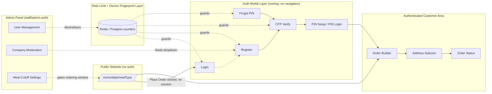
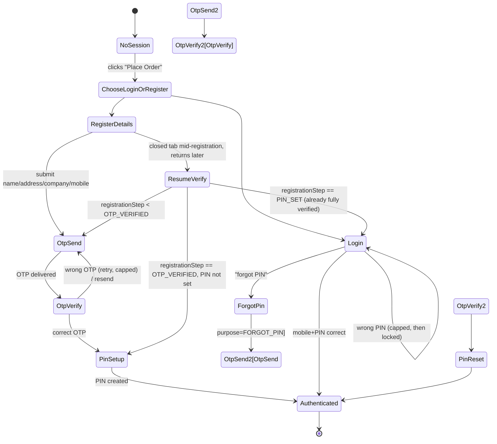

# TiffinOS — Public Ordering, Auth (OTP+PIN), and Admin Control
## Complete Implementation Plan (v3)

> **How to use this file:** This is a self-contained engineering spec. Every section has enough concrete detail (schema, endpoint contracts, validation numbers, state flows) that it can be fed directly to an LLM (Claude Code, Cursor, etc.) one section at a time, or top-to-bottom, to generate the actual implementation. Where the plan assumes something about the existing codebase that wasn't specified in the requirements doc, it's flagged with `⚠️ ASSUMPTION`.

---

## Table of Contents

1. [Scope & Assumptions](#1-scope--assumptions)
2. [High-Level Architecture](#2-high-level-architecture)
3. [Database Schema (Prisma)](#3-database-schema-prisma)
4. [Rate Limiting & Abuse Prevention](#4-rate-limiting--abuse-prevention)
5. [Device Fingerprinting & Device Binding](#5-device-fingerprinting--device-binding)
6. [Authentication & Onboarding Flow](#6-authentication--onboarding-flow)
7. [Company Directory & Moderation](#7-company-directory--moderation)
8. [Public Menu, Cutoff Time & Visibility Window](#8-public-menu-cutoff-time--visibility-window)
9. [Order Placement Flow](#9-order-placement-flow)
10. [Order Status Tracking (User Side)](#10-order-status-tracking-user-side)
11. [Admin Panel — User Management & Banning](#11-admin-panel--user-management--banning)
12. [Admin Panel — Company Moderation](#12-admin-panel--company-moderation)
13. [Admin Panel — Meal Settings / Cutoff](#13-admin-panel--meal-settings--cutoff)
14. [Complete API Route Map](#14-complete-api-route-map)
15. [Frontend Route Map & Single-URL Navigation](#15-frontend-route-map--single-url-navigation)
16. [Component Architecture & Responsive UI (Zomato-style)](#16-component-architecture--responsive-ui-zomato-style)
17. [Validation Rules — Master Reference](#17-validation-rules--master-reference)
18. [Security Checklist](#18-security-checklist)
19. [Error Codes Reference](#19-error-codes-reference)
20. [Day-wise Implementation Plan](#20-day-wise-implementation-plan)
21. [Open Questions Log](#21-open-questions-log)

---

## 1. Scope & Assumptions

This plan covers three connected feature sets for the TiffinOS customer-facing (public) side:

1. **Auth**: mobile+OTP registration, 6-digit PIN login, forgot-PIN, resume/verify-account, strict multi-layer rate limiting, device fingerprinting, admin blocking/banning.
2. **Ordering**: thali builder (max 10/order, per-thali sabji selection), add-ons (max 30/order), address selection (work default + optional home), order status tracking.
3. **Admin controls**: user block/ban (ban reversible only by admin role), company directory moderation (fake company detection), meal cutoff time + menu visibility window configuration.

**Stack** (per existing project): Next.js 14+ App Router, TypeScript, Tailwind CSS, Prisma + PostgreSQL, existing bilingual (English/Gujarati) catalog schema, existing `useSabjiPicker` hook and `/catalog` hub, WhatsApp/Baileys bridge running separately (out of scope here — this plan is the *website* ordering path).

**⚠️ ASSUMPTIONS made in this plan** (also repeated in §21):

- An `Order`/menu-item/`Sabji` catalog schema already exists from the V2 work. This plan **extends** it rather than replacing it — treat the `Order`-related models below as "reconcile with existing models," not "create from scratch."
- Staff/Admin auth (login for the admin panel) already exists as a separate model from the customer `User` model. This plan references it as `actedByStaffId: String` (a plain FK string) rather than redefining it.
- The public menu URL structure was recently changed and isn't specified. This plan uses `/menu/[date]/[mealType]` as the canonical pattern going forward — swap in whatever the current live pattern is; the auth-gating and visibility-window logic underneath is pattern-agnostic.
- SMS OTP provider is MessageCentral (per prior context) — cost-per-SMS is a real constraint, which is why the rate-limiting numbers below are deliberately strict.
- "Add-on items maximum 30 per number" is interpreted as **total add-on quantity ≤ 30 per order** (not 30 distinct SKUs). Flagged in §21 for confirmation — the validation constant is centralized in one place so this is a one-line change either way.

---

## 2. High-Level Architecture



**Key architectural decision**: the auth flow is a **modal/bottom-sheet overlay on top of the public menu page**, not a set of separate redirect pages. The user never leaves `/menu/[date]/[mealType]`. See §15 for the routing mechanics.

---

## 3. Database Schema (Prisma)

Add the following models/enums. Field names use `camelCase` to match the existing project convention. Adjust `@relation` names if they collide with existing relations in your schema.

```prisma
// ============================================================
// CUSTOMER IDENTITY
// ============================================================

enum RegistrationStep {
  DETAILS_SUBMITTED   // name/address/company/mobile captured, nothing verified yet
  OTP_VERIFIED        // mobile confirmed via OTP, PIN not set yet
  PIN_SET             // fully onboarded
}

enum UserStatus {
  ACTIVE
  BLOCKED   // soft restriction, admin-reversible by any admin/staff with permission
  BANNED    // hard restriction, reversible ONLY by ADMIN role (see §11)
}

model User {
  id                String            @id @default(cuid())
  name              String
  mobile            String            @unique
  pinHash           String?           // bcrypt hash, null until PIN_SET
  profession        String?
  registrationStep  RegistrationStep  @default(DETAILS_SUBMITTED)
  isVerified        Boolean           @default(false) // true once OTP_VERIFIED reached

  companyId         String?
  company           Company?          @relation("CompanyMembers", fields: [companyId], references: [id])
  companiesAdded    Company[]         @relation("CompanyAddedBy")
  companyNameManual String?           // holding field ONLY — see §6.2/§6.4. A typed (non-dropdown)
                                       // company name lives here, NOT as a Company row, until OTP
                                       // verification succeeds. This is what makes "store company
                                       // name in DB only if user is verified" literally true.

  addresses         Address[]
  orders            Order[]
  deviceLinks       UserDevice[]
  banHistory        BanHistory[]

  status            UserStatus        @default(ACTIVE)
  statusReason      String?
  statusChangedAt   DateTime?

  createdAt         DateTime          @default(now())
  updatedAt         DateTime          @updatedAt

  @@index([status])
  @@index([companyId])
}

enum AddressType {
  WORK
  HOME
}

model Address {
  id         String      @id @default(cuid())
  userId     String
  user       User        @relation(fields: [userId], references: [id])
  type       AddressType
  line1      String
  line2      String?
  landmark   String?
  city       String?
  pincode    String?
  isDefault  Boolean     @default(false)
  orders     Order[]
  createdAt  DateTime    @default(now())

  @@index([userId])
}

model Company {
  id                String    @id @default(cuid())
  name              String    @unique
  addedById         String?
  addedBy           User?     @relation("CompanyAddedBy", fields: [addedById], references: [id])
  members           User[]    @relation("CompanyMembers")
  isVerifiedByAdmin Boolean   @default(false)
  isFlaggedFake     Boolean   @default(false)
  flaggedReason     String?
  createdAt         DateTime  @default(now())

  @@index([isVerifiedByAdmin])
  @@index([isFlaggedFake])
}

// ============================================================
// DEVICE FINGERPRINTING (see §5 for the client-side strategy)
// ============================================================

model Device {
  id              String        @id @default(cuid())
  cookieId        String        @unique // first-party long-lived cookie UUID (primary key for matching)
  fingerprintHash String?       // sha256 of FingerprintJS visitorId, secondary signal
  lastKnownIp     String?
  userAgent       String?
  isBlocked       Boolean       @default(false)
  blockedReason   String?
  firstSeenAt     DateTime      @default(now())
  lastSeenAt      DateTime      @updatedAt
  userLinks       UserDevice[]
  otpAttempts     OtpAttempt[]
  loginAttempts   LoginAttempt[]

  @@index([fingerprintHash])
  @@index([isBlocked])
}

model UserDevice {
  id          String   @id @default(cuid())
  userId      String
  user        User     @relation(fields: [userId], references: [id])
  deviceId    String
  device      Device   @relation(fields: [deviceId], references: [id])
  linkedAt    DateTime @default(now())
  lastUsedAt  DateTime @updatedAt

  @@unique([userId, deviceId])
}

// ============================================================
// OTP / RATE-LIMIT AUDIT TRAIL
// (Redis holds the live counters; these tables are the permanent
//  audit log + fallback if Redis isn't provisioned — see §4)
// ============================================================

enum OtpPurpose {
  REGISTRATION
  FORGOT_PIN
  RESUME_VERIFY
}

model OtpAttempt {
  id            String     @id @default(cuid())
  mobile        String
  deviceId      String?
  device        Device?    @relation(fields: [deviceId], references: [id])
  ip            String
  purpose       OtpPurpose
  otpHash       String
  expiresAt     DateTime
  consumedAt    DateTime?
  wrongGuesses  Int        @default(0)
  createdAt     DateTime   @default(now())

  @@index([mobile, createdAt])
  @@index([ip, createdAt])
  @@index([deviceId, createdAt])
}

model LoginAttempt {
  id          String   @id @default(cuid())
  mobile      String
  deviceId    String?
  device      Device?  @relation(fields: [deviceId], references: [id])
  ip          String
  success     Boolean
  createdAt   DateTime @default(now())

  @@index([mobile, createdAt])
  @@index([deviceId, createdAt])
  @@index([ip, createdAt])
}

// ============================================================
// BAN / MODERATION AUDIT
// ============================================================

enum BanAction {
  BLOCKED
  UNBLOCKED
  BANNED
  UNBANNED
}

model BanHistory {
  id              String    @id @default(cuid())
  userId          String
  user            User      @relation(fields: [userId], references: [id])
  action          BanAction
  reason          String?
  actedByStaffId  String    // FK to existing staff/admin auth model
  createdAt       DateTime  @default(now())

  @@index([userId])
}

model AdminAuditLog {
  id              String   @id @default(cuid())
  actedByStaffId  String
  action          String   // "COMPANY_VERIFIED" | "COMPANY_FLAGGED_FAKE" | "MEAL_SETTINGS_UPDATED" | ...
  targetType      String   // "Company" | "MealSettings" | "User" | "Device"
  targetId        String
  metadata        Json?
  createdAt       DateTime @default(now())

  @@index([targetType, targetId])
}

// ============================================================
// MEAL / CUTOFF SETTINGS
// ============================================================

enum MealType {
  LUNCH
  DINNER
}

model MealSettings {
  id               String    @id @default(cuid())
  mealType         MealType  @unique
  cutoffTime       String    // "10:30" 24h local time (IST) — no orders accepted after this
  menuVisibleFrom  String    // "18:00" — when next cycle's menu becomes browsable again
  isOrderingOpen   Boolean   @default(true) // manual admin kill-switch, independent of cutoff
  updatedAt        DateTime  @updatedAt
}

// ============================================================
// ORDERS (reconcile with existing Order/Sabji models — see §21)
// ============================================================

enum OrderStatus {
  PLACED
  CONFIRMED
  PREPARING
  OUT_FOR_DELIVERY
  DELIVERED
  CANCELLED
}

model Order {
  id             String              @id @default(cuid())
  orderNumber    String              @unique // e.g. "TF-20260714-0007"
  userId         String
  user           User                @relation(fields: [userId], references: [id])
  mealType       MealType
  menuDate       DateTime            // the calendar date this order is for
  addressId      String
  address        Address             @relation(fields: [addressId], references: [id])
  thaliItems     OrderThaliItem[]
  addOnItems     OrderAddOnItem[]
  status         OrderStatus         @default(PLACED)
  statusHistory  OrderStatusEvent[]
  totalAmount    Decimal             @db.Decimal(10, 2)
  placedAt       DateTime            @default(now())

  @@index([userId])
  @@index([menuDate, mealType])
  @@index([status])
}

model OrderThaliItem {
  id        String   @id @default(cuid())
  orderId   String
  order     Order    @relation(fields: [orderId], references: [id])
  sabjiIds  String[] // references existing Sabji/catalog item ids chosen for this thali
  quantity  Int      @default(1)
}

model OrderAddOnItem {
  id        String  @id @default(cuid())
  orderId   String
  order     Order   @relation(fields: [orderId], references: [id])
  itemId    String  // references existing catalog add-on item id
  quantity  Int     @default(1)
}

model OrderStatusEvent {
  id              String      @id @default(cuid())
  orderId         String
  order           Order       @relation(fields: [orderId], references: [id])
  status          OrderStatus
  changedByStaffId String
  note            String?
  createdAt       DateTime    @default(now())
}
```

**Migration note:** run this as an additive migration (`prisma migrate dev --name auth_ordering_admin_v3`). None of these fields should require destructive changes to existing tables since the project is confirmed to still be pre-launch (per the source requirements: "currently it is in development, feel free to change the schema").

---

## 4. Rate Limiting & Abuse Prevention

This is the single most important non-functional requirement in the source doc — the explicit driver is real IT-employee users who will deliberately probe the OTP flow, and a real per-SMS cost on MessageCentral. Rate limiting is layered across **mobile number, device, and IP simultaneously** — a request must pass all three checks.

### 4.1 Recommended implementation

Use **Upstash Redis** (`@upstash/ratelimit` + `@upstash/redis`) for live sliding-window counters — it's serverless, works natively with Vercel/Next.js Edge or Node runtime, and needs no infra management. The Postgres tables in §3 (`OtpAttempt`, `LoginAttempt`) remain the **permanent audit trail** and double as a fallback counter source if Redis is ever unavailable (fail closed, not open — see below).

```typescript
// lib/rate-limit.ts
import { Ratelimit } from "@upstash/ratelimit";
import { Redis } from "@upstash/redis";

const redis = Redis.fromEnv();

// sliding window limiters, one per (action, scope) pair
export const otpSendByMobile = new Ratelimit({
  redis,
  limiter: Ratelimit.slidingWindow(3, "10 m"),
  prefix: "rl:otp:mobile",
});

export const otpSendByMobileDaily = new Ratelimit({
  redis,
  limiter: Ratelimit.slidingWindow(5, "24 h"),
  prefix: "rl:otp:mobile:daily",
});

export const otpSendByDevice = new Ratelimit({
  redis,
  limiter: Ratelimit.slidingWindow(5, "10 m"),
  prefix: "rl:otp:device",
});

export const otpSendByIp = new Ratelimit({
  redis,
  limiter: Ratelimit.slidingWindow(10, "10 m"),
  prefix: "rl:otp:ip",
});

export const loginAttemptsByMobile = new Ratelimit({
  redis,
  limiter: Ratelimit.slidingWindow(5, "15 m"),
  prefix: "rl:login:mobile",
});

export const loginAttemptsByDevice = new Ratelimit({
  redis,
  limiter: Ratelimit.slidingWindow(15, "1 h"),
  prefix: "rl:login:device",
});

export const registrationByDevice = new Ratelimit({
  redis,
  limiter: Ratelimit.slidingWindow(3, "24 h"),
  prefix: "rl:register:device",
});

export const registrationByIp = new Ratelimit({
  redis,
  limiter: Ratelimit.slidingWindow(8, "24 h"),
  prefix: "rl:register:ip",
});
```

A single helper wraps all of them so every route calls one function:

```typescript
// lib/guard-request.ts
export async function guardAuthRequest({
  mobile, deviceCookieId, ip, action,
}: GuardInput): Promise<{ allowed: true } | { allowed: false; code: string; retryAfterSeconds: number }> {
  // 1. Is the device or the mobile's linked user BLOCKED/BANNED? -> hard reject, no counters consumed
  // 2. Run the relevant limiter(s) for `action` (otp_send | login | register | forgot_pin)
  // 3. First limiter to fail wins; return its retryAfter
  // 4. On success, also append the durable Postgres row (OtpAttempt / LoginAttempt) for audit
}
```

### 4.2 Rate limit table (defaults — tune via env vars, do not hardcode)

| Action | Scope | Limit | Window | On breach |
|---|---|---|---|---|
| Send OTP | mobile | 3 | 10 min | 429, `retryAfterSeconds` |
| Send OTP | mobile | 5 | 24 h | 429 |
| Send OTP | device | 5 | 10 min | 429 |
| Send OTP | IP | 10 | 10 min | 429 |
| Resend OTP cooldown | mobile | 1 per cooldown | 60s → 120s → 300s (escalating per resend within the same 10-min window) | 429 with exact countdown |
| Verify OTP wrong guesses | single OTP row | 5 | until `expiresAt` | OTP invalidated, must request new one |
| OTP expiry | — | — | 5 min | `OTP_EXPIRED`, must resend |
| PIN login wrong attempts | mobile | 5 | 15 min | Mobile locked 30 min (`PIN_LOCKED`) |
| PIN login wrong attempts | device (across *any* mobile tried) | 15 | 1 h | Device auto-flagged for admin review; if it crosses 25/hr, auto-block device |
| Forgot-PIN flow starts | mobile | 3 | 24 h | 429 |
| New registration submissions | device | 3 | 24 h | 429 (prevents one device farming many fake accounts) |
| New registration submissions | IP | 8 | 24 h | 429 |

### 4.3 Fail-closed policy

If Redis is unreachable, **do not silently allow all requests** — fall back to counting rows in the Postgres `OtpAttempt`/`LoginAttempt` tables for the same windows (slower, but correct). This is why those tables are populated on every attempt regardless of Redis's availability, not just as an afterthought.

### 4.4 Blocked/banned short-circuit

Every guarded route checks, **before** touching any rate-limit counter:
- `device.isBlocked === true` → reject with `DEVICE_BLOCKED`, no counters consumed, no OTP sent.
- If mobile resolves to an existing `User` with `status IN (BLOCKED, BANNED)` → reject with `USER_BLOCKED` / `USER_BANNED`.

This ordering matters: a blocked device shouldn't be able to burn through rate-limit budget trying different mobile numbers, and it shouldn't get a generic rate-limit message that invites retrying — it should get a clear terminal message.

---

## 5. Device Fingerprinting & Device Binding

Two complementary signals, combined into one `Device` row (see schema in §3):

1. **First-party cookie** (`tos_device_id`) — a random UUID set server-side on first visit, `httpOnly: false` (client needs to read it to send with fingerprint calls), `Secure`, `SameSite=Lax`, 2-year expiry. This is the **primary key** for matching — cookies persist across sessions and are cheap to check.
2. **FingerprintJS (open-source community edition)** `@fingerprintjs/fingerprintjs` — generates a `visitorId` client-side from canvas/WebGL/font/hardware signals. Hash it (`sha256`) before sending to the server and store only the hash (`Device.fingerprintHash`) — this is a secondary/backup signal for when cookies get cleared, since the open-source edition has a non-trivial collision/instability rate on its own.

```typescript
// lib/device.ts (client)
import FingerprintJS from "@fingerprintjs/fingerprintjs";

export async function getDeviceSignature() {
  const fp = await FingerprintJS.load();
  const result = await fp.get();
  return {
    fingerprintHash: await sha256(result.visitorId), // hash client-side too, never send raw visitorId
    cookieId: getOrCreateDeviceCookie(), // reads tos_device_id, sets it via an API call if absent
  };
}
```

Every guarded auth request (`otp/send`, `login`, `register/details`, `pin/forgot/*`) includes this signature in the request body. The server upserts a `Device` row keyed on `cookieId`, and updates `fingerprintHash`/`lastKnownIp`/`userAgent` on every hit.

**Important distinction:** device fingerprinting here is **for abuse prevention, not for skipping auth**. Per the source requirement, returning users log in cross-device with mobile+PIN — there is no "trusted device" bypass. The `UserDevice` join table only exists so that when admin blocks a user, every device that user has ever logged in from can also be flagged for review (see §11).

### 5.1 Blocking cascade

When admin bans/blocks a `User`:
1. Set `User.status`.
2. For every `UserDevice` linked to that user, set `Device.isBlocked = true` **only if** that device has been used by 1 user total (i.e., not a shared office device with many legitimate accounts — avoid collateral damage). If a device has multiple linked users, flag it for manual admin review instead of auto-blocking.
3. Log to `BanHistory`.

---

## 6. Authentication & Onboarding Flow

### 6.1 Flow diagram



### 6.2 Step A — Registration: Details Submission

**Fields collected:**

| Field | Required | Notes |
|---|---|---|
| `name` | ✅ | 2–60 chars |
| `workAddress` | ✅ | line1 required; landmark/pincode optional |
| `homeAddress` | ❌ | optional at registration, addable later |
| `profession` | ✅ | free text or small enum, per existing catalog convention |
| `companyId` OR `companyNameManual` | ✅ | dropdown search; if not found, user types a name → held as raw text on `User` only, becomes an unverified `Company` row at OTP-verify (§6.4), not before |
| `mobile` | ✅ | 10-digit Indian mobile, `+91` implicit |

`POST /api/auth/register/details`

```json
// Request
{
  "name": "Ashal Yuvrajbhai",
  "profession": "Software Engineer",
  "workAddress": { "line1": "...", "landmark": "...", "pincode": "..." },
  "homeAddress": null,
  "companyId": null,
  "companyNameManual": "NewCo Pvt Ltd",
  "mobile": "9825012345",
  "device": { "cookieId": "...", "fingerprintHash": "..." }
}

// Response 200
{ "userId": "clx...", "nextStep": "OTP_SEND" }

// Response 409 (mobile already has a further-along account)
{ "error": { "code": "MOBILE_ALREADY_REGISTERED", "message": "...", "nextStep": "LOGIN" } }
```

- Creates `User` with `registrationStep = DETAILS_SUBMITTED`, `isVerified = false`.
- If `companyId` (dropdown pick) given: **not** written yet either — hold it in-memory/in the response and re-submit it at OTP-verify time, OR store it on `User.companyId` directly since a *dropdown* pick is already an admin-verified company (no fake-company risk there — see the distinction in the next bullet).
- If `companyNameManual` (typed, not in dropdown) given: **do not create a `Company` row here.** Store the raw text on `User.companyNameManual` only. This is the deliberate fix for the literal requirement "store the company name in DB, admin side, if and only if the user is registered **and** verified" — a `Company` row is itself "the company name in the DB," so it must not exist yet at this unverified stage. The `Company` row (and the link) gets created in §6.4, at the moment OTP verification succeeds.
- Guarded by `registrationByDevice` + `registrationByIp` limiters (§4.2).

### 6.3 Step — OTP Send

`POST /api/auth/otp/send`

```json
// Request
{ "mobile": "9825012345", "purpose": "REGISTRATION", "device": { "cookieId": "...", "fingerprintHash": "..." } }

// Response 200
{ "expiresInSeconds": 300, "resendAvailableInSeconds": 60 }

// Response 429
{ "error": { "code": "OTP_RATE_LIMITED", "message": "Too many OTP requests. Try again later.", "retryAfterSeconds": 420 } }
```

- Generates a 6-digit numeric OTP, `bcrypt`-hashes it, stores `OtpAttempt { mobile, deviceId, ip, purpose, otpHash, expiresAt: now+5m }`.
- Sends via MessageCentral.
- Resend cooldown escalates: 1st resend after 60s, 2nd after 120s, 3rd after 300s, within the same 10-minute mobile window — then the mobile-scoped 10-min hard limit (3 total) takes over.

### 6.4 Step — OTP Verify

`POST /api/auth/otp/verify`

```json
// Request
{ "mobile": "9825012345", "otp": "482913", "purpose": "REGISTRATION" }

// Response 200
{ "otpVerifiedToken": "eyJ...", "nextStep": "PIN_SETUP" } // short-lived, single-purpose JWT, 10 min expiry

// Response 400
{ "error": { "code": "OTP_INVALID", "message": "Incorrect code.", "attemptsRemaining": 3 } }

// Response 410
{ "error": { "code": "OTP_EXPIRED", "message": "Code expired, request a new one." } }
```

- Increments `wrongGuesses` on mismatch; at 5 wrong guesses the OTP row is invalidated (`OTP_MAX_ATTEMPTS`) and the user must request a fresh one (consuming the send-limiter budget).
- On success: `consumedAt = now()`, `User.registrationStep = OTP_VERIFIED`, `User.isVerified = true`.
- **This is the moment the company record becomes "real":** if `User.companyNameManual` is set, **create** `Company { name: user.companyNameManual, addedById: user.id, isVerifiedByAdmin: false }` right here, then set `User.companyId = company.id` and clear `companyNameManual`. Wrap this in the same DB transaction as the `registrationStep`/`isVerified` update, so a `Company` row can never exist for a user who ends up not completing OTP verification (e.g., abandons after 5 wrong guesses). This is what makes "company name stored in DB only if the user is registered *and* verified" true at the schema level, not just in application logic.
- Issues a short-lived `otpVerifiedToken` (JWT, purpose-scoped, 10-min expiry) required by the next call — this prevents someone from calling `pin/set` directly without having passed OTP.

### 6.5 Step — PIN Setup

`POST /api/auth/pin/set`

```json
// Request
{ "mobile": "9825012345", "otpVerifiedToken": "eyJ...", "pin": "483920", "confirmPin": "483920" }

// Response 200
{ "session": "set as httpOnly cookie", "user": { "id": "...", "name": "...", "isVerified": true } }
```

- Validates `pin` is exactly 6 digits, not a trivial sequence (reject `000000`, `123456`, `111111`, etc. — small denylist).
- `bcrypt.hash(pin, 10)` → `User.pinHash`, `registrationStep = PIN_SET`.
- Issues full session JWT (`tos_session` httpOnly cookie, 7-day sliding expiry).
- Upserts `UserDevice { userId, deviceId }`.
- Registration complete → auth modal closes, page context resumes (see §15.2).

### 6.6 Login (mobile + PIN)

`POST /api/auth/login`

```json
// Request
{ "mobile": "9825012345", "pin": "483920", "device": { "cookieId": "...", "fingerprintHash": "..." } }

// Response 200
{ "session": "set as httpOnly cookie", "user": { "id": "...", "name": "..." } }

// Response 423 (locked)
{ "error": { "code": "PIN_LOCKED", "message": "Too many incorrect attempts.", "retryAfterSeconds": 1800 } }
```

- Guarded by `loginAttemptsByMobile` and `loginAttemptsByDevice`.
- Logs every attempt (success or fail) to `LoginAttempt` for audit, regardless of Redis outcome.
- Works from any device by design — this is the "different device, no OTP needed" path from the requirement.

### 6.7 Forgot PIN

```
POST /api/auth/pin/forgot/send-otp   { mobile, device }
POST /api/auth/pin/forgot/verify-otp { mobile, otp }        -> { resetToken }
POST /api/auth/pin/reset             { mobile, resetToken, newPin, confirmNewPin }
```

- **Enumeration protection**: `send-otp` always returns the same generic `200 { "message": "If this number is registered, a code has been sent." }` regardless of whether the mobile exists — but only actually dispatches an SMS if it does. This satisfies "if the number exists in the DB then and only then we send OTP" without leaking which mobiles are registered to an attacker probing numbers.
- Same rate-limit and device-fingerprint machinery as registration OTP, under `purpose: FORGOT_PIN`.
- Max 3 forgot-PIN flow starts per mobile per 24h (§4.2).

### 6.8 Resume / Verify Account

Handles the "closed the tab mid-registration" case.

`GET /api/auth/registration/status?mobile=...`

```json
// Response
{ "registrationStep": "OTP_VERIFIED", "nextAction": "PIN_SETUP" }
```

- If `registrationStep === PIN_SET` → `409 { code: "ALREADY_VERIFIED", nextAction: "LOGIN" }` (rate-limited endpoint too, per the source requirement — someone shouldn't be able to hammer this to enumerate mobiles either).
- If `< OTP_VERIFIED` → resume by calling `otp/send` with `purpose: RESUME_VERIFY` (same mechanics as §6.3, separate purpose value purely for analytics/audit clarity).
- If `OTP_VERIFIED` but not `PIN_SET` → send straight to PIN setup (no need to re-verify OTP; a fresh `otpVerifiedToken` can be minted server-side since the mobile is already confirmed verified in the DB, or require one quick OTP re-check if the security bar should be higher — **⚠️ recommend requiring a fresh OTP here too**, since letting anyone who knows the mobile number jump straight to PIN setablishment is a soft spot).

---

## 7. Company Directory & Moderation

`GET /api/companies?search=abc` — public, used by the registration dropdown. Returns only `isVerifiedByAdmin: true AND isFlaggedFake: false` companies, plus always allows "Can't find your company? Type it manually" as a fallback which creates the unverified `Company` row described in §6.2.

Admin sees three buckets in the panel (§12):
- **Verified** — shown in the public dropdown.
- **Pending** (`isVerifiedByAdmin: false, isFlaggedFake: false`) — user-submitted, awaiting review, shows `addedBy` (name + mobile) so admin can trace who submitted it.
- **Flagged fake** — hidden from dropdown, and the admin action to flag-fake surfaces a one-click "also block reporter" option (not automatic — a confirm step, since a company can legitimately be a duplicate/misspelling rather than malicious).

---

## 8. Public Menu, Cutoff Time & Visibility Window

### 8.1 `MealSettings` semantics

Each `MealType` (LUNCH/DINNER) has:
- `cutoffTime` — last moment orders are accepted (e.g., lunch cutoff `10:30`).
- `menuVisibleFrom` — when the *next* cycle's menu becomes browsable again (e.g., `18:00` for tomorrow's lunch to start showing after today's dinner cutoff logic clears, or same-day for dinner after lunch's cutoff).
- `isOrderingOpen` — manual override (holiday kill-switch), independent of the time-based logic.

### 8.2 State at any given moment for a given `(date, mealType)`

| Condition | Menu state |
|---|---|
| `now < cutoffTime` AND `isOrderingOpen` | **Open** — full ordering UI |
| `now >= cutoffTime` | **Closed** — menu shown read-only, banner: "Ordering closed for today's [lunch/dinner]. Opens again at `menuVisibleFrom`." |
| `!isOrderingOpen` (manual override) | **Closed** — banner shows admin-set custom message if provided |
| `now < menuVisibleFrom` (previous cycle's closed window) | Menu for that date/meal not rendered at all — redirect to the next available one |

This state is computed server-side (in the page's server component / API) using the server's timezone-aware clock (IST), never trusted from the client.

### 8.3 Public URL

`/menu/[date]/[mealType]` e.g. `/menu/2026-07-14/lunch` — canonical, shareable, matches "Zomato type" pattern of a stable per-listing URL. ⚠️ swap for whatever pattern is already live; only the server-side gating logic above needs to sit behind it.

---

## 9. Order Placement Flow

### 9.1 Thali Builder

- Max **10 thalis** per order.
- Each thali: pick from that day's sabji options via the existing `useSabjiPicker` hook (reuse, don't rebuild) — one thali = one base combo + selected sabji swaps.
- Client-side: "+" button disabled at 10 with a toast ("Max 10 thalis per order — place a second order if you need more"). Server re-validates independently (never trust client cap).

### 9.2 Add-ons

- Max **30 total add-on quantity** per order (⚠️ see §21 — confirm distinct-SKU vs total-quantity interpretation).
- Same client-cap + server-revalidate pattern as thalis.

### 9.3 Address Selection

Triggered after "Place Order" is tapped:

- If user has **only** a work address → it's pre-selected, with a visible "+ Add Home Address" option that opens a small form inline (doesn't leave the order flow).
- If user has **both** → radio-style selector (Zomato-style address cards), defaults to whichever is `isDefault`.
- "Place Order" (final confirm) stays disabled until an address is selected.

### 9.4 Order Submission

`POST /api/orders`

```json
// Request
{
  "mealType": "LUNCH",
  "menuDate": "2026-07-14",
  "addressId": "clx...",
  "thaliItems": [ { "sabjiIds": ["s1", "s2"], "quantity": 2 }, ... ], // max 10 total quantity across all rows
  "addOnItems": [ { "itemId": "a1", "quantity": 3 }, ... ]            // max 30 total quantity
}

// Response 201
{ "orderId": "clx...", "orderNumber": "TF-20260714-0007", "status": "PLACED" }

// Response 422
{ "error": { "code": "THALI_LIMIT_EXCEEDED", "message": "Max 10 thalis per order." } }

// Response 423
{ "error": { "code": "CUTOFF_PASSED", "message": "Ordering closed for this meal window." } }
```

Server validates, in order: session valid & user not blocked/banned → cutoff window still open (§8.2, re-checked server-side even if the client page was loaded before cutoff) → thali/add-on caps → address belongs to the authenticated user → computes `totalAmount` from live catalog pricing (never trust client-sent prices) → creates `Order` + line items + initial `OrderStatusEvent { status: PLACED }`.

---

## 10. Order Status Tracking (User Side)

`GET /api/orders/mine?status=active|past` — user's own orders, paginated.
`GET /api/orders/:id` — single order with full `statusHistory` timeline.

Status values flow linearly: `PLACED → CONFIRMED → PREPARING → OUT_FOR_DELIVERY → DELIVERED`, with `CANCELLED` reachable from any pre-`DELIVERED` state (staff/admin action, out of scope here — covered when the staff panel is built). The user-facing UI renders this as a simple horizontal/vertical timeline (see §16).

---

## 11. Admin Panel — User Management & Banning

| Action | Who can do it | Reversible by |
|---|---|---|
| **Block** | Any staff with `users:moderate` permission | Any staff with `users:moderate` |
| **Unblock** | Same | — |
| **Ban** | `ADMIN` role only | `ADMIN` role only |
| **Unban** | `ADMIN` role only | — |

`POST /api/admin/users/:id/ban` — server-side role check (`req.staff.role === 'ADMIN'`), **not** just a hidden button in the UI. Sets `User.status = BANNED`, cascades device blocking per §5.1, writes `BanHistory { action: BANNED, actedByStaffId, reason }`.

A banned/blocked user hitting any auth or order endpoint gets an immediate, unambiguous rejection (`USER_BANNED` / `USER_BLOCKED`) — no partial functionality leaks through.

Admin user list view: search by mobile/name/company, filter by status, column showing linked device count and last-seen device, one-click "View ban history."

---

## 12. Admin Panel — Company Moderation

Three tabs: **Pending**, **Verified**, **Flagged**.

- `POST /api/admin/companies/:id/verify` → `isVerifiedByAdmin = true`, now appears in the public registration dropdown.
- `POST /api/admin/companies/:id/flag-fake` → `{ reason, alsoBlockReporter: boolean }`. If `alsoBlockReporter`, chains into the block-user action from §11 against `company.addedById`.
- `DELETE /api/admin/companies/:id` — hard delete, only allowed once flagged (prevents accidental deletion of a company mid-legitimate-review).
- Every action writes to `AdminAuditLog`.

---

## 13. Admin Panel — Meal Settings / Cutoff

Simple settings page, two rows (LUNCH, DINNER):

```
GET  /api/admin/meal-settings
PUT  /api/admin/meal-settings/:mealType   { cutoffTime, menuVisibleFrom, isOrderingOpen }
```

Time inputs as `HH:mm` (24h, IST implicit). Changes take effect immediately for the current cycle's evaluation (§8.2) — no caching layer should sit between this table and the public menu page's server-side render beyond a short (≤30s) revalidation window if using ISR.

---

## 14. Complete API Route Map

| Method | Route | Auth | Purpose |
|---|---|---|---|
| POST | `/api/auth/register/details` | none (rate-limited) | §6.2 |
| POST | `/api/auth/otp/send` | none (rate-limited) | §6.3 |
| POST | `/api/auth/otp/verify` | none (rate-limited) | §6.4 |
| POST | `/api/auth/pin/set` | `otpVerifiedToken` | §6.5 |
| POST | `/api/auth/login` | none (rate-limited) | §6.6 |
| POST | `/api/auth/pin/forgot/send-otp` | none (rate-limited) | §6.7 |
| POST | `/api/auth/pin/forgot/verify-otp` | none (rate-limited) | §6.7 |
| POST | `/api/auth/pin/reset` | `resetToken` | §6.7 |
| GET | `/api/auth/registration/status` | none (rate-limited) | §6.8 |
| POST | `/api/auth/logout` | session | clears cookie |
| GET | `/api/companies` | none | §7 |
| GET | `/api/menu/:date/:mealType` | none | §8 |
| POST | `/api/addresses` | session | add home address post-registration |
| GET | `/api/addresses/mine` | session | §9.3 |
| POST | `/api/orders` | session | §9.4 |
| GET | `/api/orders/mine` | session | §10 |
| GET | `/api/orders/:id` | session | §10 |
| GET | `/api/admin/users` | staff | §11 |
| POST | `/api/admin/users/:id/block` \| `/unblock` \| `/ban` \| `/unban` | staff (`ban`/`unban` = ADMIN only) | §11 |
| GET | `/api/admin/companies` | staff | §12 |
| POST | `/api/admin/companies/:id/verify` \| `/flag-fake` | staff | §12 |
| DELETE | `/api/admin/companies/:id` | staff | §12 |
| GET/PUT | `/api/admin/meal-settings` | staff | §13 |

---

## 15. Frontend Route Map & Single-URL Navigation

```
app/
  (public)/
    menu/[date]/[mealType]/page.tsx     ← the ONE public URL, everything happens here
  (admin)/
    admin/users/page.tsx
    admin/companies/page.tsx
    admin/settings/meal-cutoff/page.tsx
  api/...
```

### 15.1 Why one URL

Per the requirement to keep the user panel "easy to navigate... that one public URL, complete things there" — the flow is modeled on Zomato/Swiggy: browsing, login, registration, and ordering all happen **without leaving the menu page's URL**. There is no `/login`, `/register`, `/order` page to navigate to and from.

### 15.2 How it works technically

A single client-side context, `AuthOrderFlowProvider`, wraps the menu page and holds:

```typescript
type FlowState =
  | { step: "browsing" }
  | { step: "auth"; mode: "choose" | "login" | "register" | "otp" | "pin-setup" | "forgot-pin"; pendingAction?: "place-order" }
  | { step: "order-builder" }
  | { step: "address-select" }
  | { step: "confirmed"; orderId: string };
```

- Tapping "Place Order" while unauthenticated sets `step: "auth", pendingAction: "place-order"` — this opens the auth overlay (bottom sheet on mobile, centered modal on desktop) **on top of** the still-visible, still-scrollable menu.
- On successful auth, the provider checks `pendingAction` and automatically continues into `order-builder` — the user never has to re-tap "Place Order."
- The overlay uses Next.js **intercepting routes** (`@auth/(.)login` convention) if deep-linkability of each auth step is wanted (e.g., a direct link to `/menu/2026-07-14/lunch/login` still renders the menu behind it), or simple client state if that's overkill for this use case — ⚠️ **recommendation: start with plain client state** (simpler, no route-interception complexity) and only move to intercepting routes if there's a real need to deep-link into a specific auth step.
- Browser back button closes the current overlay step rather than navigating away, via `history.pushState` shims tied to `FlowState` transitions.

---

## 16. Component Architecture & Responsive UI (Zomato-style)

### 16.1 Layout shell

- **Desktop (≥1024px)**: sticky top navbar (logo, date/meal-type toggle, login/profile), content in a centered max-width column, modals render centered with backdrop.
- **Mobile (<768px)**: sticky top bar (logo + hamburger only), sticky **bottom order bar** appears once ≥1 thali is added ("2 Thalis · ₹240 · View Order →", exactly like Zomato/Swiggy's cart bar), overlays render as bottom sheets that slide up (use `vaul` or a small custom drawer — respects safe-area-inset for notches).

### 16.2 Core components

| Component | Responsibility |
|---|---|
| `MenuHeader` | date, meal-type toggle (Lunch/Dinner tabs), cutoff countdown badge |
| `ThaliBuilderCard` | one thali's sabji selection, wraps existing `useSabjiPicker` |
| `AddOnGrid` | responsive grid, quantity steppers, running total badge |
| `StickyOrderBar` | mobile-only, appears/disappears based on cart state |
| `AuthOverlay` | routes to the right step component based on `FlowState.mode` |
| `OtpInputBoxes` | 6 separate auto-advancing digit boxes, paste-friendly |
| `PinPad` | large touch targets (≥44px), numeric-only, mobile-optimized |
| `AddressSheet` | bottom sheet (mobile) / modal (desktop), radio cards + inline "add new" form |
| `OrderStatusTimeline` | vertical stepper, current status highlighted |
| `AdminUserTable` | search/filter/status badges/action menu (block/ban with confirm dialogs) |
| `AdminCompanyTabs` | Pending/Verified/Flagged tab view |

### 16.3 Responsiveness rules

- Mobile-first Tailwind: base styles target mobile, `md:`/`lg:` add desktop refinements — not the reverse.
- All tap targets ≥44×44px (PIN pad, OTP boxes, stepper buttons — this audience is mobile-heavy per "IT employees ordering from phones at work").
- Bottom sheets, not full-page navigation, for every auth/order sub-step on mobile — reinforces the single-URL principle in §15.

---

## 17. Validation Rules — Master Reference

| Field | Rule |
|---|---|
| `name` | 2–60 chars, letters/spaces only |
| `mobile` | exactly 10 digits, Indian mobile number pattern |
| `pin` | exactly 6 digits, reject sequential/repeated denylist (`123456`, `000000`, `111111`, `654321`, etc.) |
| `otp` | exactly 6 digits, expires 5 min, max 5 wrong guesses |
| `workAddress.line1` | required, 5–200 chars |
| `homeAddress` | optional at registration; addable anytime after |
| `companyNameManual` | 2–100 chars if used instead of dropdown |
| thali count | 1–10 per order |
| add-on total quantity | 0–30 per order |
| `cutoffTime` / `menuVisibleFrom` | `HH:mm` 24h format, server validates parse-ability |

---

## 18. Security Checklist

- [ ] PINs hashed with `bcrypt` (cost 10+) or `argon2id` — never stored/logged in plaintext. Since 6-digit PINs have low entropy (~1M combinations), **the rate limiter is the real defense**, not the hash strength alone.
- [ ] OTPs hashed at rest, 5-min expiry, single-use (`consumedAt` set atomically).
- [ ] Session JWT in `httpOnly`, `Secure`, `SameSite=Lax` cookie — never in `localStorage`.
- [ ] `otpVerifiedToken` / `resetToken` are purpose-scoped JWTs (can't be replayed for a different action) with short expiry (10 min).
- [ ] Every mutating route runs Zod validation on input before touching the DB.
- [ ] Admin routes check role **server-side** on every request — UI hiding a button is not access control.
- [ ] Forgot-PIN and resume-verify endpoints return generic responses regardless of whether the mobile exists (enumeration protection), while still being rate-limited.
- [ ] All admin actions (ban, unban, company verify/flag/delete, meal-settings change) write to an audit table with `actedByStaffId` + timestamp.
- [ ] Rate limiters fail closed (Postgres fallback), never open, if Redis is unreachable (§4.3).
- [ ] Device cookie is set via a `Set-Cookie` response header from a first-party API route, never client-`document.cookie`, to reduce tampering surface.
- [ ] CSRF protection on all state-changing routes (same-site cookie + origin check is sufficient for a same-origin Next.js app; add a CSRF token if the API is ever split to a separate domain).

---

## 19. Error Codes Reference

All API errors share this shape:

```json
{ "error": { "code": "OTP_RATE_LIMITED", "message": "Human-readable message", "retryAfterSeconds": 45 } }
```

| Code | HTTP | Meaning |
|---|---|---|
| `DEVICE_BLOCKED` | 403 | Device is blocked, regardless of mobile tried |
| `USER_BLOCKED` | 403 | Account soft-restricted |
| `USER_BANNED` | 403 | Account hard-restricted, admin-only reversal |
| `MOBILE_ALREADY_REGISTERED` | 409 | Mobile already has a further-along account; suggest login |
| `OTP_RATE_LIMITED` | 429 | Too many OTP sends in window |
| `OTP_INVALID` | 400 | Wrong code entered |
| `OTP_EXPIRED` | 410 | Code past 5-min expiry |
| `OTP_MAX_ATTEMPTS` | 400 | 5 wrong guesses on this OTP, must resend |
| `PIN_INVALID` | 400 | Wrong PIN on login |
| `PIN_LOCKED` | 423 | Too many wrong PIN attempts, temporary lock |
| `PIN_WEAK` | 400 | PIN matched denylist (sequential/repeated) |
| `ALREADY_VERIFIED` | 409 | Resume-verify called on a fully onboarded account |
| `COMPANY_NAME_REQUIRED` | 400 | Neither `companyId` nor `companyNameManual` given |
| `THALI_LIMIT_EXCEEDED` | 422 | >10 thalis in order |
| `ADDON_LIMIT_EXCEEDED` | 422 | >30 add-on quantity in order |
| `ADDRESS_REQUIRED` | 422 | No address selected at order confirm |
| `CUTOFF_PASSED` | 423 | Ordering window closed for this meal/date |
| `ADMIN_ONLY_ACTION` | 403 | Non-ADMIN staff attempted ban/unban |

---

## 20. Day-wise Implementation Plan

**Day 1 — Foundations**
Prisma schema additions + migration (§3), Redis/Upstash setup, `rate-limit.ts` + `guard-request.ts` (§4), device fingerprinting client util + cookie route (§5).

**Day 2 — Auth backend**
All `/api/auth/*` routes (§6), OTP send via MessageCentral, PIN hashing, session JWT issuance, audit logging to `OtpAttempt`/`LoginAttempt`.

**Day 3 — Auth frontend**
`AuthOrderFlowProvider` + `AuthOverlay` + `OtpInputBoxes` + `PinPad` components (§15, §16), wired to Day 2 endpoints, mobile bottom-sheet + desktop modal variants.

**Day 4 — Ordering**
`ThaliBuilderCard` + `AddOnGrid` + `StickyOrderBar` + `AddressSheet` (§9, §16), `POST /api/orders` with full server-side re-validation, `OrderStatusTimeline` (§10).

**Day 5 — Admin panel**
User management (block/ban with role gating, §11), company moderation tabs (§12), meal-settings page (§13), `AdminAuditLog` wiring throughout.

**Day 6 — Cutoff/visibility polish + QA**
`MealSettings` gating logic on the public menu page (§8.2), full responsive pass on mobile (safe-area insets, tap targets), rate-limit load testing (simulate rapid OTP/login abuse to confirm 429s trigger correctly), end-to-end walk of every flow in §6's state diagram including edge cases (closed tab mid-registration, wrong PIN lockout, cutoff mid-session).

---

## 21. Open Questions Log

These are places where this plan made a reasonable default — confirm or adjust before/while implementing:

1. **Add-on limit interpretation**: "maximum 30 per number" — implemented as total quantity ≤30 per order. If it should instead mean 30 *distinct* add-on SKUs, it's a one-line change in the validator (§9.2, §17).
2. **Existing Order/Sabji schema**: this plan assumes an existing catalog/Sabji model from the V2 work and only adds order-management models around it. Reconcile field names against the actual current schema before running the migration.
3. **Public menu URL pattern**: assumed `/menu/[date]/[mealType]`; confirm against whatever the current live pattern actually is post-change, and re-point §8.3/§15 accordingly (the gating logic itself doesn't care about the exact pattern).
4. **Resume-verify → PIN setup**: recommended requiring a fresh OTP even when `registrationStep === OTP_VERIFIED` already, rather than letting anyone who knows the mobile number jump straight to setting a PIN. Flagged as a deliberate stricter-than-literal-spec choice in §6.8 — worth a conscious yes/no.
5. **Shared-device collateral blocking**: when banning a user, devices linked to more than one account are flagged for manual review instead of auto-blocked, to avoid locking out an office's shared kiosk/PC. Confirm this trade-off is acceptable versus stricter auto-blocking.
6. **Staff/admin auth model**: assumed to already exist separately from customer `User`; `actedByStaffId` is a plain string FK. Point it at the actual model/table name once confirmed.
7. **Block vs. Ban as two tiers**: the source doc uses "blocking" (point A, general abuse/fake-company response, device+number cascade) and "banning...permanently, admin-only revert" (point 5) somewhat interchangeably in places. This plan treats them as two distinct severities — `BLOCKED` (any staff with permission, reversible by staff) and `BANNED` (ADMIN role only, reversible only by ADMIN) — which is an engineering interpretation to satisfy point 5's "admin only" clause without making *every* block require an admin. Confirm this two-tier split matches intent, or whether "blocked" and "banned" should collapse into a single status.
8. **"Cutoff time set by default on the profile"**: read as "a default cutoff time configured on the admin's settings/profile page," implemented as one global `MealSettings` row per meal type (not per-user, not per-day-of-week). If a per-day-of-week or per-user override was meant, `MealSettings` needs a `dayOfWeek` or scoping column added.